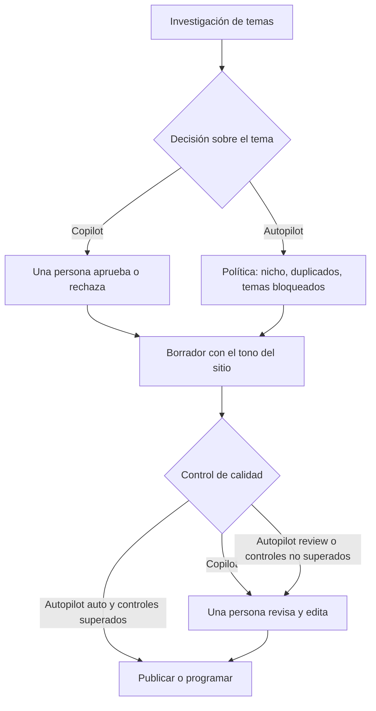
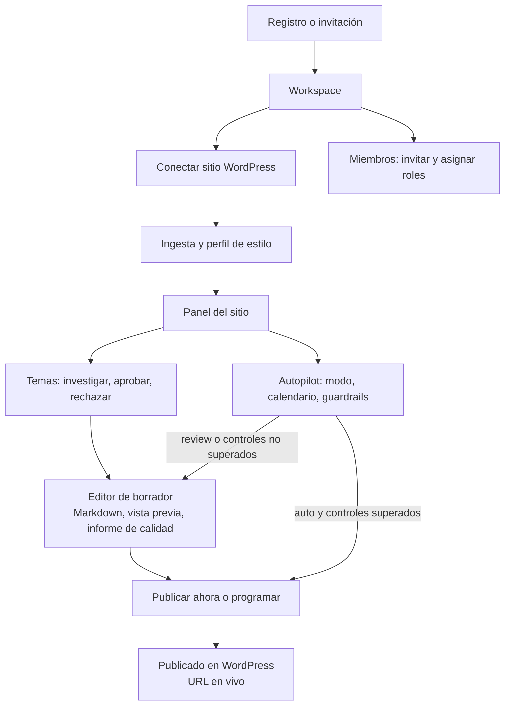
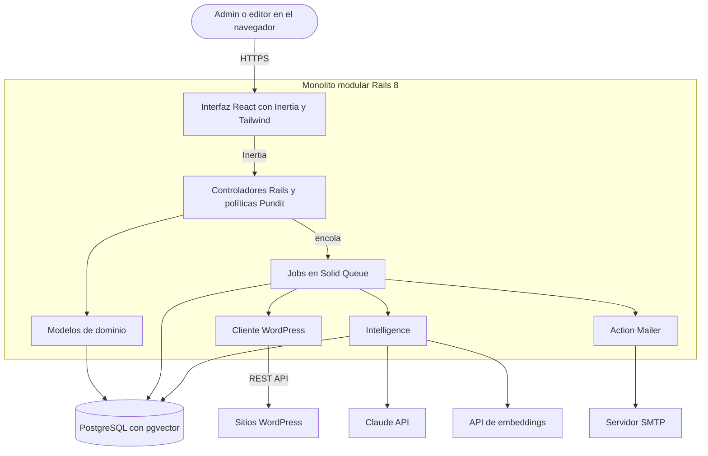
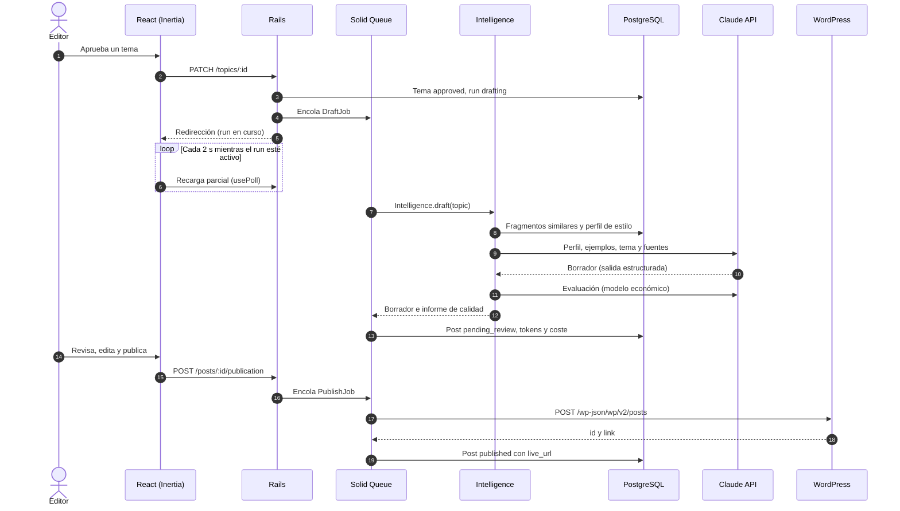
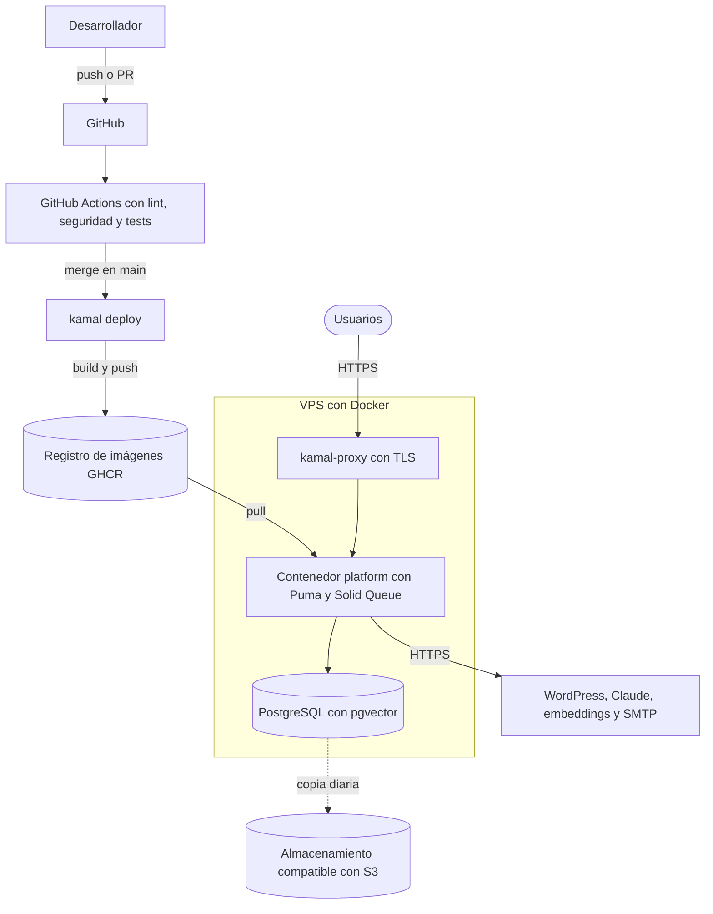
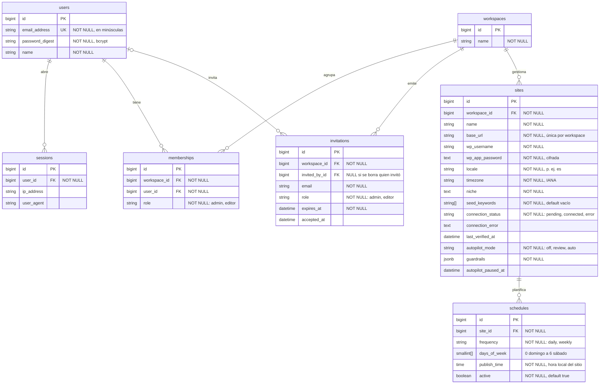
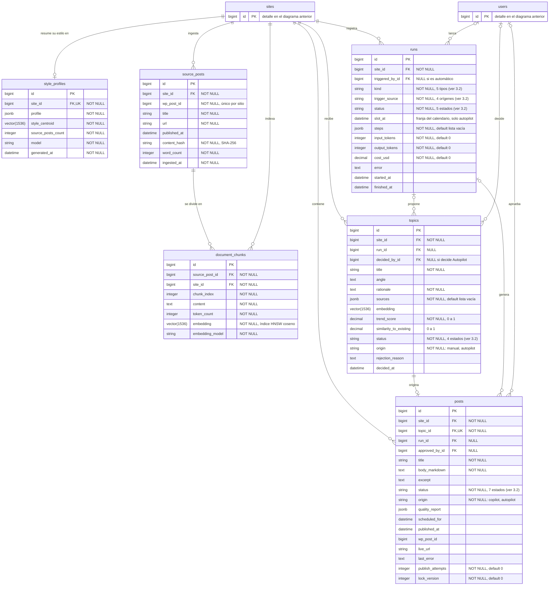

## Índice

0. [Ficha del proyecto](#0-ficha-del-proyecto)
1. [Descripción general del producto](#1-descripción-general-del-producto)
2. [Arquitectura del sistema](#2-arquitectura-del-sistema)
3. [Modelo de datos](#3-modelo-de-datos)
4. [Especificación de la API](#4-especificación-de-la-api)
5. [Historias de usuario](#5-historias-de-usuario)
6. [Tickets de trabajo](#6-tickets-de-trabajo)
7. [Pull requests](#7-pull-requests)

---

## 0. Ficha del proyecto

### **0.1. Tu nombre completo:**

Oscar Helamán Suárez Alvarez

### **0.2. Nombre del proyecto:**

WP AutoPilot AI

### **0.3. Descripción breve del proyecto:**

WP AutoPilot AI es un copiloto de contenidos con IA para WordPress. Aprende la voz de cada sitio a partir de sus publicaciones anteriores, investiga temas de actualidad en su nicho, redacta artículos con ese mismo tono y los publica o programa a través de la REST API de WordPress.

Funciona en dos modos por sitio:

- **Copilot (humano en el bucle):** la IA propone temas y borradores; las personas del equipo aprueban, editan y publican.
- **Autopilot:** la IA investiga, redacta y programa sola según un calendario, dentro de unos límites de seguridad (guardrails). Si un borrador no los supera, vuelve a revisión humana.

Un mismo workspace puede gestionar **varios sitios WordPress** con un equipo con roles (administrador y editor).

### **0.4. URL del proyecto:**

Pendiente de despliegue. Se publicará con la primera versión funcional (Entrega 2).

### 0.5. URL o archivo comprimido del repositorio

https://github.com/osuarez1/AI4Devs-finalproject (repositorio público)

---

## 1. Descripción general del producto

### **1.1. Objetivo:**

**Problema.** Publicar con constancia en un blog exige investigar temas, redactar, mantener la voz de la marca y publicar a tiempo. Para pymes, profesionales y agencias que gestionan uno o varios WordPress, es la tarea que antes se abandona. Las herramientas de IA genéricas tampoco lo resuelven: el texto no suena a la marca, repite temas ya tratados y hay que copiarlo y pegarlo a mano en WordPress.

**Solución.** WP AutoPilot AI se conecta a cada sitio WordPress mediante su REST API, sin instalar plugins, y cubre el ciclo completo:

1. Aprende el estilo del sitio a partir de sus últimas 50 publicaciones.
2. Investiga temas de actualidad en su nicho, con fuentes, y descarta los que ya se han tratado.
3. Redacta borradores con el tono del sitio mediante RAG (recuperación de fragmentos similares del propio blog más un perfil de estilo).
4. Publica o programa en WordPress y devuelve la URL publicada.
5. Opcionalmente, lo hace todo en piloto automático, con límites de calidad, frecuencia y presupuesto.

**Para quién.**

| Segmento | Necesidad principal |
|---|---|
| Responsables de contenido o marketing en pymes | Mantener una cadencia de publicación sin dedicar horas a investigar y redactar |
| Freelancers y agencias con varios sitios de clientes | Gestionar varios WordPress, cada uno con su voz y su calendario, desde un único panel y con un equipo con roles |
| Creadores y bloggers | Publicar con regularidad sin perder su estilo personal |

**Valor aportado.** Menos tiempo de la idea a la publicación, contenido coherente con la voz de cada sitio, sin temas duplicados y con control humano configurable, desde la revisión de cada pieza hasta el piloto automático con salvaguardas.

**Métricas de éxito del MVP.**

- Tiempo medio desde la aprobación de un tema hasta la publicación.
- Porcentaje de borradores aprobados sin cambios mayores.
- Porcentaje de franjas del calendario cumplidas en modo Autopilot.
- Coste de IA por post publicado.

### **1.2. Características y funcionalidades principales:**

**Modos de operación.** Los dos modos comparten el mismo flujo; en Autopilot, las decisiones humanas se sustituyen por controles automáticos:



**Funcionalidades del MVP.**

1. **Workspaces, equipo y roles.** Registro, inicio de sesión e invitaciones por email. Dos roles por workspace: *admin* (conexión de sitios, Autopilot, miembros) y *editor* (temas, borradores y publicación). Una persona puede pertenecer a varios workspaces.
2. **Gestión multisitio.** Cada workspace conecta tantos sitios WordPress como necesite (URL, usuario y Application Password). Cada sitio tiene su propio nicho, idioma, zona horaria, estilo, temas, calendario y configuración de Autopilot.
3. **Aprendizaje del estilo.** Ingesta de los últimos 50 posts publicados, fragmentación, embeddings en pgvector y generación de un *perfil de estilo* del sitio (voz, tono, formalidad, estructura habitual, longitud media).
4. **Investigación de temas.** Búsqueda web con fuentes, puntuación de oportunidad y detección de duplicados frente al historial del sitio y a temas ya aprobados o rechazados. Cada tema se aprueba o se rechaza con un clic.
5. **Redacción con el tono del sitio (RAG).** Borrador en Markdown con título, extracto y fuentes, más un informe de calidad: longitud, enlaces, similitud de estilo y valoración de un modelo evaluador.
6. **Revisión y edición.** Editor Markdown con vista previa. Si dos personas editan a la vez, gana la primera en guardar y la segunda recibe un aviso de conflicto (bloqueo optimista).
7. **Publicación y programación.** Publicar ya o en una fecha y hora en la zona horaria del sitio. La plataforma envía a WordPress HTML saneado, guarda la URL publicada y reintenta si hay errores transitorios.
8. **Autopilot con guardrails.** Tres modos por sitio (*off*, *review*, *auto*), calendario de publicación y límites configurables:
   - máximo de posts por semana y presupuesto mensual;
   - temas bloqueados y dominios de enlace permitidos;
   - puntuación mínima de calidad;
   - pausa automática tras fallos consecutivos.
9. **Trazabilidad y costes.** Historial de ejecuciones por sitio con decisiones, puntuaciones, tokens y coste. Es el registro de auditoría de Autopilot.

**Fuera del alcance del MVP.** Permisos por sitio dentro de un workspace, imágenes destacadas generadas con IA, asignación automática de categorías y etiquetas, campos SEO de plugins de terceros, facturación e interfaz en otros idiomas (el contenido sí se genera en el idioma de cada sitio).

### **1.3. Diseño y experiencia de usuario:**

> Las capturas de pantalla y el vídeo del recorrido completo se incorporarán cuando exista la primera versión funcional (Entrega 2). Por ahora se documentan el recorrido y las pantallas previstas.

**Recorrido principal.**



**Pantallas previstas.**

| Pantalla | Propósito | Roles |
|---|---|---|
| Acceso y registro | Crear cuenta y workspace, iniciar sesión, recuperar contraseña, aceptar invitaciones | Todos |
| Selector de workspace y sitios | Cambiar de workspace y de sitio; estado de conexión y modo Autopilot de cada sitio | Admin, editor |
| Conectar sitio (asistente en 3 pasos) | URL y credenciales → verificación → nicho, idioma y zona horaria | Admin |
| Panel del sitio | Estado de la conexión, perfil de estilo, próximas publicaciones y últimas ejecuciones | Admin, editor |
| Temas | Investigar, aprobar o rechazar; fuentes, puntuación y aviso de posible duplicado | Admin, editor |
| Editor de borrador | Markdown con vista previa, informe de calidad, publicar o programar | Admin, editor |
| Calendario | Publicaciones programadas y franjas de Autopilot del sitio | Admin, editor |
| Autopilot | Modo, calendario, guardrails, pausar y reanudar | Admin |
| Miembros | Invitar, cambiar rol, retirar acceso | Admin |
| Historial y consumo | Ejecuciones, decisiones de Autopilot, tokens y coste | Admin |

**Principios de UX.**

- **El humano decide** en Copilot, y Autopilot se puede pausar en cualquier momento.
- **Transparencia:** cada tema muestra sus fuentes y cada borrador su informe de calidad. Cada decisión de Autopilot queda explicada en el historial.
- **Progreso visible:** las tareas largas (ingesta, investigación, redacción) muestran su estado sin recargar la página.
- **Contexto multisitio siempre visible:** el sitio activo aparece en la cabecera y todas las acciones se aplican solo a ese sitio.

### **1.4. Instrucciones de instalación:**

> Instrucciones previstas para el entorno local; se validarán con la primera versión funcional (Entrega 2).

**Requisitos:** Git, Docker (con Docker Compose) y [mise](https://mise.jdx.dev/) (o Ruby 3.4+ y Node.js 22 LTS+ instalados manualmente).

```bash
# 1. Clonar el repositorio
git clone https://github.com/osuarez1/AI4Devs-finalproject.git
cd AI4Devs-finalproject

# 2. Instalar las versiones de Ruby y Node fijadas en mise.toml
mise install

# 3. Variables de entorno (claves de IA, SMTP, etc.)
cp .env.example .env

# 4. Servicios de apoyo: PostgreSQL + pgvector, WordPress + MySQL y Mailpit
docker compose up -d

# 5. WordPress local de prueba: usuario con rol Autor, Application Password y posts de ejemplo
make wp-seed

# 6. Aplicación: gems, paquetes npm, base de datos, semillas y arranque (Rails + Vite + Solid Queue)
cd apps/platform
bin/setup
```

| URL local | Servicio |
|---|---|
| http://localhost:3000 | WP AutoPilot AI (los usuarios de demostración se definen en `db/seeds.rb`) |
| http://localhost:8080 | WordPress local (`WP_ENVIRONMENT_TYPE=local`, que permite Application Passwords sin HTTPS) |
| http://localhost:8025 | Mailpit (bandeja de los emails de invitación y avisos) |

**Variables de entorno principales** (`.env.example`):

| Variable | Descripción |
|---|---|
| `DATABASE_URL` | Conexión a PostgreSQL (una única base de datos) |
| `ANTHROPIC_API_KEY` | Clave de la API de Claude (investigación, redacción y evaluación) |
| `LLM_MODEL_PRIMARY` | Modelo para investigación y redacción. Por defecto `claude-opus-5` |
| `LLM_MODEL_FAST` | Modelo económico para clasificación y evaluación de calidad. Por defecto `claude-haiku-4-5` |
| `OPENAI_API_KEY` | Clave de la API de embeddings |
| `EMBEDDING_MODEL` | `text-embedding-3-small` (1536 dimensiones). Cambiarlo obliga a reindexar |
| `RAILS_MASTER_KEY` | Descifra `config/credentials` (incluye las claves de Active Record Encryption) |
| `SMTP_ADDRESS`, `SMTP_PORT` | Servidor de correo; en local, Mailpit (`localhost:1025`) |
| `APP_HOST` | Host público usado en los enlaces de los emails |

**Tests:**

```bash
cd apps/platform
bundle exec rspec        # backend: modelos, políticas, jobs, peticiones
npm test                 # frontend: Vitest + React Testing Library
npx playwright test      # end-to-end contra el WordPress local
```

---

## 2. Arquitectura del Sistema

### **2.1. Diagrama de arquitectura:**



En el diagrama, *Cliente WordPress* corresponde a `Wordpress::Client` e *Intelligence* al módulo de IA; ambos se describen a continuación y en §2.2.

**Patrón.** Es un **monolito modular** sobre Rails 8: MVC con controladores delgados, modelos con las reglas de negocio, objetos de servicio y jobs en segundo plano. Las integraciones externas quedan detrás de dos módulos con una interfaz estrecha, al estilo de puertos y adaptadores:

- `Wordpress::Client`: el único código que habla con WordPress y el único que usa sus credenciales.
- `Intelligence`: todo el trabajo de IA detrás de cuatro operaciones:

  | Operación | Resultado |
  |---|---|
  | `Intelligence.ingest(site, posts)` | Fragmentos, embeddings y perfil de estilo |
  | `Intelligence.research(site)` | Temas candidatos con fuentes |
  | `Intelligence.draft(topic)` | Título, cuerpo en Markdown y fuentes |
  | `Intelligence.evaluate(post)` | Informe de calidad: puntuación e incidencias |

  Fuera de `Intelligence` nadie ve un prompt, un nombre de modelo ni un vector.

**Por qué esta arquitectura.**

- **Una persona desarrollando, pocas semanas y mucho alcance.** Autopilot, roles reales y multisitio forman parte del MVP. Un solo runtime (Ruby) y un solo despliegue concentran el esfuerzo en el producto y no en integrar servicios entre sí.
- **Rails 8 trae de serie lo que el producto necesita:**
  - colas persistentes con tareas recurrentes y control de concurrencia (Solid Queue), sin Redis;
  - autenticación;
  - cifrado de atributos;
  - límites de peticiones (rate limiting);
  - despliegue con Kamal.
- **Una sola base de datos PostgreSQL con pgvector.** Los fragmentos y sus embeddings tienen claves foráneas reales hacia su sitio: al borrar un sitio se borran en cascada, sin llamadas de limpieza entre servicios. También hay un único responsable de las migraciones.
- **Inertia.js** permite una interfaz en React con la experiencia de una SPA sin mantener una API separada ni resolver autenticación entre dominios. Las pantallas se alimentan directamente de los controladores de Rails.

**Beneficios.**

- Menor complejidad operativa: un contenedor de aplicación y la base de datos.
- Transacciones y consistencia fuertes entre negocio, colas y vectores.
- Desarrollo y depuración más rápidos, con un único flujo de tests y despliegue.
- La interfaz `Intelligence` permite extraer la parte de IA más adelante sin reescribir el resto.

**Sacrificios y déficits.**

- **Ecosistema de IA en Ruby más pequeño** que el de Python, con menos frameworks de agentes y de evaluación. Se mitiga usando el SDK oficial de Anthropic para Ruby y resolviendo en código propio lo que este flujo necesita, que es acotado.
- **La carga de IA comparte recursos con la web.** Se mitiga ejecutando los jobs en procesos separados, que en producción pueden pasar a un rol propio de Kamal.
- **Una base de datos única es un punto único de fallo.** Se mitiga con copias diarias; las réplicas quedan fuera del MVP.
- **Inertia acopla la interfaz a los controladores y no ofrece una API pública.** Se mitiga haciendo que los endpoints clave también respondan en JSON (ver §4).
- **Dependencia de proveedores externos de IA.** Se mitiga configurando modelos por tarea y encapsulando los proveedores en `Intelligence`.

**Alternativas consideradas.**

| Opción | Descripción | Motivo del descarte para el MVP |
|---|---|---|
| **A. Monolito modular Rails** (elegida) | Interfaz, jobs, WordPress e IA en una sola aplicación | — |
| B. Rails + servicio FastAPI | La IA en un servicio Python (uv, LangChain) y el resto en Rails | Dos runtimes y una API interna que mantener; con una sola base de datos, el esquema compartido acopla ambos servicios |
| C. Next.js + API Rails + FastAPI | El borrador inicial: tres servicios | Tres runtimes, dos contratos de API y autenticación entre dominios, un coste desproporcionado para una persona y un MVP |

**Evolución prevista.** Si la carga o las necesidades de IA lo justifican (agentes más complejos, evaluación avanzada con herramientas de Python), `Intelligence` se extrae a un servicio FastAPI (opción B). Sus cuatro operaciones pasan a ser llamadas HTTP y el resto de la aplicación no cambia. El repositorio ya está organizado para alojar varias aplicaciones (`apps/`).

### **2.2. Descripción de componentes principales:**

| Componente | Tecnología | Responsabilidad |
|---|---|---|
| Interfaz web | React 19, TypeScript, Tailwind CSS 4, Inertia.js 2, Vite (`vite_rails`) | Pantallas con navegación tipo SPA servidas por Rails; recargas parciales y *polling* (`usePoll`) para mostrar el progreso de tareas largas |
| Controladores | Rails 8 + `inertia_rails` | Validar la entrada, autorizar, delegar en modelos y servicios, y responder con una página Inertia o con JSON |
| Autenticación | Generador de autenticación de Rails 8 (`has_secure_password`, sesiones en base de datos), `generates_token_for` para invitaciones | Registro, inicio de sesión, recuperación de contraseña, invitaciones con caducidad |
| Autorización y multitenencia | Pundit + `Current.workspace` | Matriz de permisos por rol (admin, editor); todas las consultas se filtran por el workspace del usuario |
| Dominio | Active Record | Workspace, Membership, Site, Schedule, SourcePost, DocumentChunk, StyleProfile, Topic, Post y Run, con estados validados |
| Tareas en segundo plano | Solid Queue (+ Mission Control – Jobs para supervisión) | Ingesta, investigación, redacción, publicación y tick de Autopilot (tarea recurrente cada 15 min); como máximo una ejecución por sitio a la vez (`limits_concurrency`) |
| Cliente de WordPress | Cliente HTTP con protección SSRF (`ssrf_filter`) | Verificar la conexión, leer posts publicados y publicar; único componente con acceso a las credenciales de WordPress |
| Intelligence | SDK oficial `anthropic` para Ruby (Claude), API de embeddings, `neighbor` + pgvector, Nokogiri, `commonmarker` | Fragmentado y embeddings, perfil de estilo, investigación con búsqueda web, redacción con RAG y controles de calidad |
| Base de datos | PostgreSQL 17 + pgvector | Datos de negocio, vectores con índice HNSW y colas de Solid Queue en una sola base de datos |
| Correo | Action Mailer (SMTP; Mailpit en local) | Invitaciones, avisos de revisión pendiente y alertas de Autopilot |
| Despliegue | Docker, Kamal 2, kamal-proxy, Thruster | Despliegue sin interrupción en un VPS con TLS automático |

**Submódulos de `Intelligence`.**

- **`Chunker`:** convierte el HTML de WordPress en texto (Nokogiri) y lo divide por encabezados y párrafos en fragmentos de unos 500 tokens con un pequeño solapamiento.
- **`Embedder`:** genera embeddings por lotes y registra el modelo usado en cada fragmento.
- **`StyleProfiler`:** analiza una muestra representativa de posts y produce el perfil de estilo como salida estructurada (JSON Schema). Calcula también el *centroide de estilo*, la media de los embeddings del sitio.
- **`TopicResearcher`:** llama a Claude con la herramienta de búsqueda web del servidor (`web_search`), que devuelve resultados con fuentes, y pide los candidatos como salida estructurada. Después descarta los que superan un umbral de similitud con los posts del sitio y con temas previos.
- **`Drafter`:** recupera los 8 fragmentos del sitio más similares al tema (distancia coseno sobre HNSW, filtrando por sitio). Con ellos, el perfil de estilo y las fuentes, genera el borrador en Markdown en el idioma del sitio. El prefijo estable del prompt (instrucciones y perfil de estilo) se cachea para reducir coste.
- **`QualityGate`:** combina reglas deterministas bloqueantes (longitud, dominios de enlace permitidos, HTML saneable) con la valoración de un modelo evaluador económico y la similitud entre el borrador y el centroide de estilo.
- **`Usage`:** registra los tokens y el coste de cada llamada en la ejecución (`runs`) correspondiente.

Modelos por tarea, configurables: `claude-opus-5` para investigación y redacción, y `claude-haiku-4-5` para clasificación y evaluación. Los embeddings usan `text-embedding-3-small` (1536 dimensiones), un único modelo en toda la instalación, porque mezclar modelos haría incomparables los vectores.

**Flujo Copilot: de la aprobación de un tema a la publicación.**



**Flujo Autopilot.**

1. El job recurrente `AutopilotTickJob` se ejecuta cada 15 minutos y busca los sitios con Autopilot activo que tienen una franja del calendario dentro del margen de preparación (24 h por defecto).
2. Por cada franja encola una ejecución `AutopilotRunJob`, única por sitio y franja y como máximo una a la vez por sitio.
3. Esa ejecución encadena investigación, control de temas, redacción y control de calidad.
4. El resultado depende del modo:
   - En *review*, el borrador queda pendiente de revisión y se avisa a los editores.
   - En *auto*, si supera todos los controles, se programa para la franja.
   - Si no los supera, pasa a revisión humana con los motivos.
5. Cada decisión queda registrada en `runs`.

**Programación de la publicación.** La gestiona la propia plataforma: un job de Solid Queue programado para `scheduled_for` publica el post en WordPress con `status: publish`. No se usa WP-Cron, que depende de las visitas al sitio y puede publicar tarde en sitios con poco tráfico. Así además se obtiene la URL definitiva en el momento de publicar.

### **2.3. Descripción de alto nivel del proyecto y estructura de ficheros**

El repositorio es un **monorepo preparado para varias aplicaciones**. En el MVP contiene una sola, `apps/platform` (el monolito Rails); si en el futuro se extrae la parte de IA, el servicio se añadiría como `apps/intelligence`. La aplicación Rails vive en un subdirectorio, y no en la raíz, por dos motivos: separa el código de la documentación del proyecto, y evita que `rails new` genere un `README.md` que en sistemas de ficheros que no distinguen mayúsculas, como el de macOS por defecto, sobrescribiría este `readme.md`.

```
AI4Devs-finalproject/
├── readme.md                       # Documentación del proyecto (entregable)
├── prompts.md                      # Prompts utilizados (entregable)
├── docs/                           # Material extendido: ADR, diagramas y especificación OpenAPI (api/openapi.yaml)
├── openspec/                       # Cambios (propuesta, especificación, diseño, tareas) y especificaciones vivas
├── apps/
│   └── platform/                   # Aplicación Rails 8 (monolito modular)
│       ├── app/
│       │   ├── controllers/        # Controladores delgados: responden Inertia o JSON
│       │   ├── models/             # Modelos de dominio y reglas de negocio
│       │   ├── policies/           # Autorización Pundit (matriz rol × acción)
│       │   ├── jobs/               # Ingest, Research, Draft, Publish, AutopilotTick, AutopilotRun
│       │   ├── mailers/            # Invitaciones y avisos
│       │   ├── services/
│       │   │   ├── wordpress/      # Cliente REST de WordPress y protección SSRF
│       │   │   ├── intelligence.rb # Fachada: ingest · research · draft · evaluate
│       │   │   └── intelligence/   # Chunker, Embedder, StyleProfiler, TopicResearcher, Drafter, QualityGate
│       │   └── frontend/           # Código de la interfaz (Vite)
│       │       ├── entrypoints/    # Arranque de Inertia
│       │       ├── pages/          # Una página React por acción de controlador (Topics/Index.tsx…)
│       │       ├── components/     # Componentes reutilizables
│       │       └── lib/            # Tipos, utilidades y textos de la interfaz (i18n)
│       ├── config/
│       │   ├── recurring.yml       # Tareas recurrentes de Solid Queue (tick de Autopilot)
│       │   └── deploy.yml          # Configuración de despliegue con Kamal
│       ├── db/                     # Migraciones, esquema y semillas
│       ├── spec/                   # RSpec: modelos, políticas, jobs, servicios, peticiones (rswag)
│       ├── e2e/                    # Tests end-to-end con Playwright
│       └── Dockerfile              # Imagen de producción
├── infra/
│   └── wordpress/                  # Semillas del WordPress local (WP-CLI)
├── compose.yaml                    # Desarrollo: PostgreSQL+pgvector, WordPress+MySQL, Mailpit
├── mise.toml                       # Versiones fijadas de Ruby y Node
├── Makefile                        # Atajos: make up · wp-seed · test
├── .env.example                    # Variables de entorno necesarias, sin secretos
└── .github/workflows/              # Integración continua por aplicación, filtrada por rutas
```

**Convenciones.**

- Se siguen las convenciones de Rails: "convention over configuration", controladores RESTful y rutas anidadas y superficiales (`/workspaces/:id/sites`, `/sites/:id/topics`, `/topics/:id`).
- Las integraciones externas viven en `app/services/`, detrás de fachadas con interfaz estrecha.
- Las páginas de Inertia reflejan la estructura de los controladores (`TopicsController#index` → `pages/Topics/Index.tsx`).

### **2.4. Infraestructura y despliegue**

**Entorno local.** La aplicación se ejecuta en la máquina de desarrollo con `bin/dev`, que arranca Rails, Vite y el proceso de Solid Queue. Los servicios de apoyo se levantan con Docker Compose:

| Servicio | Imagen | Puerto | Uso |
|---|---|---|---|
| `postgres` | `pgvector/pgvector:pg17` | 5432 | Base de datos única de la plataforma |
| `wordpress` | `wordpress` (oficial) | 8080 | WordPress de desarrollo y de tests end-to-end, con `WP_ENVIRONMENT_TYPE=local` |
| `mysql` | `mysql:8.4` | — | Base de datos del WordPress local |
| `wp-cli` | `wordpress:cli` | — | Semillas: usuario con rol Autor, Application Password y posts de ejemplo |
| `mailpit` | `axllent/mailpit` | 8025 (web), 1025 (SMTP) | Captura de los emails enviados |

**Producción.**



- **Servidor:** un VPS (por ejemplo, Hetzner o DigitalOcean) con Docker, gestionado por Kamal 2.
- **Aplicación:** un contenedor con Thruster y Puma. Solid Queue se ejecuta dentro de Puma (`SOLID_QUEUE_IN_PUMA`); si la carga de IA lo requiere, se separa en un rol `job` de Kamal sin cambiar código.
- **Base de datos:** PostgreSQL 17 con pgvector como accesorio de Kamal, con volumen persistente y copias diarias (`pg_dump`) a un almacenamiento compatible con S3.
- **TLS y enrutado:** kamal-proxy con certificados de Let's Encrypt y cambio de versión sin interrupción, tras comprobar el endpoint de salud `/up`.
- **Secretos:** `.kamal/secrets` lee las variables del entorno de CI. Nunca se versionan.

**Proceso de despliegue.**

1. Cada PR ejecuta GitHub Actions en `apps/platform`:
   - análisis estático: RuboCop, ESLint;
   - seguridad: Brakeman, `bundler-audit`, `npm audit`;
   - tests: RSpec con PostgreSQL + pgvector como servicio, y Vitest.
   Los tests end-to-end con Playwright se ejecutan en `main` y cada noche.
2. Al fusionar en `main`, el workflow de despliegue ejecuta `kamal deploy`. Este comando:
   - construye la imagen y la publica en GHCR;
   - arranca el nuevo contenedor, que aplica las migraciones con `db:prepare` al iniciar;
   - espera a que `/up` responda y solo entonces kamal-proxy cambia el tráfico.
3. La marcha atrás se hace con `kamal rollback <versión>`.

**Observabilidad.**

- Logs de Rails en la salida estándar, consultables con `kamal app logs`.
- Mission Control – Jobs para supervisar colas y reintentos, protegido con autenticación básica.
- El panel de consumo de IA se construye a partir de la tabla `runs`.

### **2.5. Seguridad**

1. **Autenticación.**
   - Generador de autenticación de Rails 8: contraseñas con bcrypt (`has_secure_password`).
   - Sesiones persistidas en base de datos y referenciadas por una cookie firmada `httpOnly`, `Secure` y `SameSite=Lax`.
   - Tokens de recuperación de contraseña con caducidad.
   - `rate_limit` en el inicio de sesión (p. ej., 10 intentos cada 3 minutos por IP).
2. **Autorización y aislamiento entre workspaces.**
   - Cada acción pasa por una política Pundit según el rol (admin o editor).
   - Todas las consultas parten del workspace actual (`policy_scope`), de modo que acceder a un recurso de otro workspace devuelve 404. Así se evitan los IDOR (acceso a recursos ajenos cambiando un identificador).
   - Un workspace no puede quedarse sin administradores.
3. **Credenciales de WordPress.**
   - Se usan **Application Passwords**, nunca la contraseña principal del usuario.
   - Se cifran en la base de datos con Active Record Encryption (`encrypts :wp_app_password`).
   - Nunca se envían al navegador, porque las props de Inertia se construyen con listas explícitas de campos.
   - No aparecen en los logs: el patrón `passw` de `filter_parameters` ya las filtra.
   - Se recomienda un usuario de WordPress dedicado con **rol Autor** (mínimo privilegio). Administradores y editores tienen `unfiltered_html` en instalaciones de un solo sitio, y con ellos WordPress publicaría tal cual cualquier `<script>`. La plataforma avisa si el usuario conectado tiene más privilegios de los necesarios.
4. **SSRF (Server-Side Request Forgery).** La URL del sitio la introduce el usuario y el servidor hace peticiones a ella, así que antes de conectar:
   - se exige HTTPS en producción;
   - se resuelve el DNS y se bloquean direcciones privadas, de loopback, link-local y de metadatos de la nube (p. ej. `169.254.169.254`);
   - se validan de nuevo las redirecciones y se aplican tiempos de espera cortos (`ssrf_filter`).
5. **Inyección de prompts y contenido generado.**
   - Las instrucciones viven en el prompt de sistema. El contenido web de la investigación llega como resultados de herramienta y se trata como datos: nunca se siguen instrucciones encontradas en páginas.
   - El Markdown generado se convierte a HTML y se sanea con una lista de etiquetas y atributos permitidos antes de enviarlo a WordPress.
   - En Autopilot, el control de calidad bloquea enlaces a dominios no permitidos, que son la carga típica de una inyección. Además, cualquier fallo devuelve el borrador a revisión humana.
6. **Protección de la propia aplicación.**
   - Protección CSRF de Rails en todas las peticiones que modifican datos.
   - React escapa la salida por defecto. La vista previa del borrador solo renderiza HTML ya saneado.
   - Cabeceras de *Content Security Policy*.
   - Parámetros permitidos explícitamente (*strong parameters*).
7. **Secretos.**
   - Credenciales cifradas de Rails y variables de entorno inyectadas por Kamal. En el repositorio solo se versiona `.env.example`.
   - Las claves de IA solo existen en el servidor.
8. **Abuso y costes.**
   - Presupuesto mensual y máximo de posts por sitio (guardrails).
   - `rate_limit` en las acciones que disparan IA.
   - Una sola ejecución concurrente por sitio.
9. **Dependencias y análisis estático.** Brakeman, `bundler-audit`, `npm audit` y Dependabot en CI.
10. **Auditoría.** La tabla `runs` registra quién o qué lanzó cada operación, las decisiones tomadas, sus puntuaciones, los tokens y el coste.

### **2.6. Tests**

> Estrategia prevista. Los ejemplos concretos se ampliarán a medida que se implementen las funcionalidades.

| Nivel | Herramientas | Qué cubre |
|---|---|---|
| Unitarios | RSpec, FactoryBot | Validaciones y estados, políticas (matriz rol × acción), fragmentado, reglas del control de calidad, protección SSRF |
| Integración | RSpec, WebMock, VCR | Jobs con WordPress y proveedores de IA simulados; `Intelligence` con respuestas grabadas; búsqueda vectorial real en PostgreSQL |
| API | Request specs + rswag | Contratos de los endpoints de §4; generan `docs/api/openapi.yaml` |
| Frontend | Vitest, React Testing Library | Componentes y estados de las páginas de temas y editor |
| End-to-end | Playwright + WordPress local | Flujo completo, con la IA simulada: conectar sitio → investigar → aprobar → borrador → publicar |
| Evaluación de IA | Tarea `bin/rails intelligence:eval` (bajo demanda, no en CI por coste) | Conjunto de referencia sobre sitios de demostración: similitud de estilo, cero enlaces no permitidos, longitud en rango, tasa de aprobación del evaluador |

**Casos de prueba representativos.**

1. **Permisos:** un editor no puede crear, modificar ni eliminar sitios (403) y un admin sí.
2. **Aislamiento:** un usuario del workspace A recibe 404 al pedir un tema del workspace B.
3. **SSRF:** se rechazan `http://127.0.0.1`, `http://169.254.169.254`, `http://[::1]`, dominios que resuelven a `10.0.0.0/8` y redirecciones hacia direcciones privadas.
4. **Verificación:** si WordPress responde 401, se muestra "credenciales rechazadas" y el sitio no se guarda.
5. **Ingesta idempotente:** reingestar un post sin cambios (mismo `content_hash`) no crea fragmentos nuevos.
6. **Búsqueda vectorial:** los fragmentos recuperados pertenecen siempre al sitio consultado.
7. **Control de calidad:** un borrador con un enlace a un dominio no permitido falla con la incidencia `disallowed_link`.
8. **Saneado:** `<script>` y los atributos `on*` desaparecen del HTML enviado a WordPress.
9. **Límites de Autopilot:** con el máximo semanal alcanzado, la ejecución queda `skipped` sin llamar a la IA.
10. **Idempotencia de Autopilot:** dos ticks para la misma franja generan una única ejecución (índice único por sitio y franja).
11. **Edición concurrente:** guardar con un `lock_version` obsoleto devuelve un conflicto y no sobrescribe los cambios de otra persona.
12. **End-to-end:** el post publicado existe en el WordPress local y su `live_url` responde 200.

---

## 3. Modelo de Datos

### **3.1. Diagrama del modelo de datos:**

Todas las tablas residen en **una única base de datos PostgreSQL** con la extensión `vector`. Para facilitar la lectura, el modelo se divide en dos diagramas que comparten las entidades `sites` y `users`. Todas las tablas incluyen `created_at` y `updated_at` (`datetime NOT NULL`), que se omiten en los diagramas. Los valores completos de los enumerados figuran en §3.2.

**Diagrama A · Usuarios, workspaces y sitios**



**Diagrama B · Contenido, IA y ejecuciones** (`sites` y `users` se detallan en el diagrama A)



### **3.2. Descripción de entidades principales:**

**Convenciones comunes.**

- Claves primarias `bigint` autoincrementales.
- Los enumerados se guardan como `string` con restricción `CHECK` en la base de datos y enum validado en el modelo (`enum ..., validate: true`).
- Las claves foráneas llevan índice.
- Todo el contenido de un sitio se borra en cascada al borrar el sitio. Las referencias a usuarios en registros históricos (quién decidió, aprobó o lanzó algo) pasan a `NULL` al borrar al usuario, para conservar el historial.
- Las tablas de infraestructura de Solid Queue (`solid_queue_*`) están en la misma base de datos (configuración de base de datos única) y no forman parte del modelo de dominio.

#### `users`
Personas que usan la plataforma. Tabla generada por el generador de autenticación de Rails 8.

| Campo | Tipo | Restricciones | Descripción |
|---|---|---|---|
| `id` | bigint | PK | Identificador |
| `email_address` | string | NOT NULL, UNIQUE, normalizado a minúsculas | Email de acceso |
| `password_digest` | string | NOT NULL | Hash bcrypt (`has_secure_password`) |
| `name` | string | NOT NULL, 1–100 caracteres | Nombre visible |

Relaciones: 1:N con `sessions` y `memberships`. Aparece como autor en `invitations.invited_by_id`, `topics.decided_by_id`, `posts.approved_by_id` y `runs.triggered_by_id` (todas `ON DELETE SET NULL`).

#### `sessions`
Sesiones activas, una por dispositivo. La cookie firmada `session_id` referencia esta tabla.

| Campo | Tipo | Restricciones | Descripción |
|---|---|---|---|
| `id` | bigint | PK | Identificador de sesión |
| `user_id` | bigint | FK → `users`, NOT NULL, `ON DELETE CASCADE` | Propietario |
| `ip_address` | string | — | IP de inicio de sesión |
| `user_agent` | string | — | Navegador o dispositivo |

#### `workspaces`
Unidad de multitenencia: un equipo, una agencia o una persona. Agrupa miembros y sitios.

| Campo | Tipo | Restricciones | Descripción |
|---|---|---|---|
| `id` | bigint | PK | Identificador |
| `name` | string | NOT NULL, 1–100 caracteres | Nombre del workspace |

Relaciones: 1:N con `memberships`, `invitations` y `sites`. Regla de dominio: siempre debe quedar al menos una membresía con rol `admin`.

#### `memberships`
Pertenencia de un usuario a un workspace, con su rol.

| Campo | Tipo | Restricciones | Descripción |
|---|---|---|---|
| `id` | bigint | PK | Identificador |
| `workspace_id` | bigint | FK → `workspaces`, NOT NULL, `ON DELETE CASCADE` | Workspace |
| `user_id` | bigint | FK → `users`, NOT NULL, `ON DELETE CASCADE` | Usuario |
| `role` | string | NOT NULL, CHECK `admin`/`editor` | Rol en el workspace |

Índices: UNIQUE (`workspace_id`, `user_id`).

#### `invitations`
Invitaciones pendientes o aceptadas para unirse a un workspace. El token no se almacena: se deriva con `generates_token_for :invitation`, caduca a los 7 días y queda invalidado al rellenarse `accepted_at`.

| Campo | Tipo | Restricciones | Descripción |
|---|---|---|---|
| `id` | bigint | PK | Identificador |
| `workspace_id` | bigint | FK → `workspaces`, NOT NULL, `ON DELETE CASCADE` | Workspace destino |
| `invited_by_id` | bigint | FK → `users`, NULL, `ON DELETE SET NULL` | Quién invitó |
| `email` | string | NOT NULL, normalizado | Email invitado |
| `role` | string | NOT NULL, CHECK `admin`/`editor` | Rol que tendrá al aceptar |
| `expires_at` | datetime | NOT NULL | Caducidad (7 días) |
| `accepted_at` | datetime | NULL | Fecha de aceptación |

Índices: UNIQUE parcial (`workspace_id`, `lower(email)`) WHERE `accepted_at IS NULL`, para que no haya dos invitaciones pendientes al mismo email.

#### `sites`
Sitio WordPress conectado. Un workspace puede tener **varios sitios**, y todo el contenido, el estilo, el calendario y la configuración de Autopilot cuelgan del sitio.

| Campo | Tipo | Restricciones | Descripción |
|---|---|---|---|
| `id` | bigint | PK | Identificador |
| `workspace_id` | bigint | FK → `workspaces`, NOT NULL, `ON DELETE CASCADE` | Workspace propietario |
| `name` | string | NOT NULL | Nombre visible del sitio |
| `base_url` | string | NOT NULL; HTTPS en producción; normalizada sin barra final | URL raíz del WordPress |
| `wp_username` | string | NOT NULL | Usuario de WordPress (recomendado: rol Autor) |
| `wp_app_password` | text | NOT NULL; cifrada (Active Record Encryption); nunca se expone | Application Password |
| `locale` | string | NOT NULL, default `es` | Idioma del contenido (BCP 47) |
| `timezone` | string | NOT NULL, default `Europe/Madrid` | Zona horaria IANA del calendario |
| `niche` | text | NOT NULL, ≤ 1000 caracteres | Nicho y audiencia del sitio |
| `seed_keywords` | string[] | NOT NULL, default `{}`, ≤ 20 | Palabras clave semilla para la investigación |
| `connection_status` | string | NOT NULL, default `pending`, CHECK `pending`/`connected`/`error` | Estado de la conexión |
| `connection_error` | text | NULL | Último error de verificación |
| `last_verified_at` | datetime | NULL | Última verificación correcta |
| `autopilot_mode` | string | NOT NULL, default `off`, CHECK `off`/`review`/`auto` | Modo de Autopilot |
| `guardrails` | jsonb | NOT NULL, default con valores seguros | Límites de Autopilot (ver abajo) |
| `autopilot_paused_at` | datetime | NULL | Si tiene valor, Autopilot está pausado (manual o automáticamente) |

Índices: UNIQUE (`workspace_id`, `base_url`). El mismo sitio puede conectarse en workspaces distintos.

Claves de `guardrails`: `max_posts_per_week`, `monthly_budget_usd`, `min_quality_score` (0–1), `min_words`, `max_words`, `blocked_topics[]`, `allowed_link_domains[]`, `max_consecutive_failures` (default 3) y `lead_time_hours` (margen de preparación, default 24).

#### `schedules`
Franjas de publicación del sitio. Las usa Autopilot y sirven de sugerencia al programar en Copilot.

| Campo | Tipo | Restricciones | Descripción |
|---|---|---|---|
| `id` | bigint | PK | Identificador |
| `site_id` | bigint | FK → `sites`, NOT NULL, `ON DELETE CASCADE` | Sitio |
| `frequency` | string | NOT NULL, CHECK `daily`/`weekly` | Frecuencia |
| `days_of_week` | smallint[] | NOT NULL, default `{}`; valores 0–6 | Días de la semana (solo `weekly`) |
| `publish_time` | time | NOT NULL | Hora local, en la zona horaria del sitio |
| `active` | boolean | NOT NULL, default `true` | Franja activa |

Restricción: CHECK (`frequency = 'daily'` OR `cardinality(days_of_week) > 0`).

#### `source_posts`
Posts publicados en WordPress que se han ingerido como referencia de estilo y para detectar duplicados. Los posts que publica la propia plataforma se reincorporan aquí tras publicarse.

| Campo | Tipo | Restricciones | Descripción |
|---|---|---|---|
| `id` | bigint | PK | Identificador |
| `site_id` | bigint | FK → `sites`, NOT NULL, `ON DELETE CASCADE` | Sitio |
| `wp_post_id` | bigint | NOT NULL | ID del post en WordPress |
| `title` | string | NOT NULL | Título |
| `url` | string | NOT NULL | Enlace público |
| `published_at` | datetime | NULL | Fecha de publicación en WordPress |
| `content_hash` | string | NOT NULL | SHA-256 del texto limpio (evita reprocesar lo que no cambia) |
| `word_count` | integer | NOT NULL, ≥ 0 | Número de palabras |
| `ingested_at` | datetime | NOT NULL | Última ingesta |

Índices: UNIQUE (`site_id`, `wp_post_id`).

#### `document_chunks`
Fragmentos de texto de los posts ingeridos, con su embedding. Son la base del RAG y de la detección de duplicados.

| Campo | Tipo | Restricciones | Descripción |
|---|---|---|---|
| `id` | bigint | PK | Identificador |
| `source_post_id` | bigint | FK → `source_posts`, NOT NULL, `ON DELETE CASCADE` | Post de origen |
| `site_id` | bigint | FK → `sites`, NOT NULL, `ON DELETE CASCADE` | Desnormalizado para filtrar las búsquedas por sitio |
| `chunk_index` | integer | NOT NULL, ≥ 0 | Posición dentro del post |
| `content` | text | NOT NULL | Texto del fragmento (~500 tokens) |
| `token_count` | integer | NOT NULL | Tamaño en tokens |
| `embedding` | vector(1536) | NOT NULL | Embedding del fragmento |
| `embedding_model` | string | NOT NULL | Modelo que generó el embedding |

Índices: UNIQUE (`source_post_id`, `chunk_index`); índice sobre `site_id`; índice **HNSW** sobre `embedding` con `vector_cosine_ops`.

#### `style_profiles`
Perfil de estilo de un sitio (uno por sitio). Se genera tras la ingesta y se inyecta en cada prompt de redacción.

| Campo | Tipo | Restricciones | Descripción |
|---|---|---|---|
| `id` | bigint | PK | Identificador |
| `site_id` | bigint | FK → `sites`, NOT NULL, UNIQUE, `ON DELETE CASCADE` | Sitio |
| `profile` | jsonb | NOT NULL | Voz, tono, formalidad, persona gramatical, longitud media, estructura típica, recursos habituales, expresiones a evitar, ejemplos de titulares |
| `style_centroid` | vector(1536) | NOT NULL | Media de los embeddings del sitio, usada para puntuar la similitud de estilo de los borradores |
| `source_posts_count` | integer | NOT NULL | Posts analizados |
| `model` | string | NOT NULL | Modelo que generó el perfil |
| `generated_at` | datetime | NOT NULL | Fecha de generación |

#### `topics`
Temas propuestos por la investigación, por una persona o por Autopilot, con su decisión.

| Campo | Tipo | Restricciones | Descripción |
|---|---|---|---|
| `id` | bigint | PK | Identificador |
| `site_id` | bigint | FK → `sites`, NOT NULL, `ON DELETE CASCADE` | Sitio |
| `run_id` | bigint | FK → `runs`, NULL, `ON DELETE SET NULL` | Ejecución que lo propuso |
| `decided_by_id` | bigint | FK → `users`, NULL, `ON DELETE SET NULL` | Quién decidió (NULL si fue Autopilot) |
| `title` | string | NOT NULL, ≤ 200 caracteres | Título propuesto |
| `angle` | text | NULL | Enfoque sugerido |
| `rationale` | text | NOT NULL | Por qué es relevante ahora |
| `sources` | jsonb | NOT NULL, default `[]` | Fuentes: `[{url, title, published_at}]` |
| `embedding` | vector(1536) | NULL | Embedding del tema, para detectar duplicados frente a temas previos |
| `trend_score` | decimal(4,3) | NOT NULL, CHECK 0–1 | Puntuación de oportunidad: combina la recencia y el número de fuentes encontradas con la valoración del modelo sobre el encaje con el nicho. No es un dato de Google Trends |
| `similarity_to_existing` | decimal(4,3) | NULL, CHECK 0–1 | Máxima similitud con posts y temas previos del sitio |
| `status` | string | NOT NULL, default `suggested`, CHECK `suggested`/`approved`/`rejected`/`drafted` | Estado |
| `origin` | string | NOT NULL, CHECK `manual`/`autopilot` | Origen |
| `rejection_reason` | text | NULL | Motivo del rechazo (opcional) |
| `decided_at` | datetime | NULL | Fecha de la decisión |

Índices: (`site_id`, `status`, `created_at`).

#### `posts`
Contenido generado por la plataforma, desde el borrador hasta la publicación. Cada tema aprobado origina como máximo un post.

| Campo | Tipo | Restricciones | Descripción |
|---|---|---|---|
| `id` | bigint | PK | Identificador |
| `site_id` | bigint | FK → `sites`, NOT NULL, `ON DELETE CASCADE` | Sitio |
| `topic_id` | bigint | FK → `topics`, NOT NULL, UNIQUE, `ON DELETE CASCADE` | Tema de origen |
| `run_id` | bigint | FK → `runs`, NULL, `ON DELETE SET NULL` | Ejecución de redacción |
| `approved_by_id` | bigint | FK → `users`, NULL, `ON DELETE SET NULL` | Quién aprobó la publicación (NULL si fue Autopilot) |
| `title` | string | NOT NULL, ≤ 200 caracteres | Título |
| `body_markdown` | text | NOT NULL | Cuerpo editable en Markdown |
| `excerpt` | text | NULL | Extracto |
| `status` | string | NOT NULL, CHECK (ver estados) | Estado del ciclo de vida |
| `origin` | string | NOT NULL, CHECK `copilot`/`autopilot` | Modo que lo generó |
| `quality_report` | jsonb | NULL | Puntuaciones e incidencias del control de calidad |
| `scheduled_for` | datetime | NULL; obligatorio si `scheduled` | Fecha y hora de publicación programada (UTC) |
| `published_at` | datetime | NULL | Fecha real de publicación |
| `wp_post_id` | bigint | NULL | ID devuelto por WordPress |
| `live_url` | string | NULL | URL pública del post publicado |
| `last_error` | text | NULL | Último error de publicación |
| `publish_attempts` | integer | NOT NULL, default 0 | Intentos de publicación (reintentos con espera exponencial) |
| `lock_version` | integer | NOT NULL, default 0 | Bloqueo optimista contra ediciones simultáneas |

Índices: UNIQUE parcial (`site_id`, `wp_post_id`) WHERE `wp_post_id IS NOT NULL`; (`site_id`, `status`); (`status`, `scheduled_for`).

Estados: `generating` → `pending_review` → `scheduled` o `publishing` → `published`. De `publishing` se puede pasar a `failed`, que admite reintento, y cualquier borrador no publicado puede pasar a `discarded`.

#### `runs`
Ejecuciones de tareas largas (ingesta, investigación, redacción, publicación y Autopilot). Alimentan el progreso en la interfaz, el control de presupuesto y la auditoría.

| Campo | Tipo | Restricciones | Descripción |
|---|---|---|---|
| `id` | bigint | PK | Identificador |
| `site_id` | bigint | FK → `sites`, NOT NULL, `ON DELETE CASCADE` | Sitio |
| `triggered_by_id` | bigint | FK → `users`, NULL, `ON DELETE SET NULL` | Quién la lanzó (NULL si fue automática) |
| `kind` | string | NOT NULL, CHECK `ingestion`/`research`/`drafting`/`publication`/`autopilot` | Tipo |
| `trigger_source` | string | NOT NULL, CHECK `user`/`schedule`/`autopilot`/`system` | Origen del disparo |
| `status` | string | NOT NULL, default `queued`, CHECK `queued`/`running`/`succeeded`/`failed`/`skipped` | Estado |
| `slot_at` | datetime | NULL | Franja del calendario (solo `autopilot`) |
| `steps` | jsonb | NOT NULL, default `[]` | Pasos, decisiones y puntuaciones (registro de auditoría) |
| `input_tokens` | integer | NOT NULL, default 0 | Tokens de entrada consumidos |
| `output_tokens` | integer | NOT NULL, default 0 | Tokens de salida consumidos |
| `cost_usd` | decimal(10,4) | NOT NULL, default 0 | Coste estimado |
| `error` | text | NULL | Error, si falló |
| `started_at` | datetime | NULL | Inicio |
| `finished_at` | datetime | NULL | Fin |

Índices: UNIQUE parcial (`site_id`, `slot_at`) WHERE `kind = 'autopilot'`, que impide preparar dos veces la misma franja; (`site_id`, `kind`, `created_at`) para el historial y la suma del presupuesto mensual.

---

## 4. Especificación de la API

La interfaz usa Inertia, así que no necesita una API REST separada. Aun así, **las mismas rutas responden en JSON** cuando la petición incluye `Accept: application/json`, lo que permite probarlas, documentarlas y automatizarlas. La autenticación usa la cookie de sesión y el token CSRF de Rails.

**Especificación completa:** [`docs/api/openapi.yaml`](docs/api/openapi.yaml), en formato OpenAPI 3.0.3, con esquemas, ejemplos y respuestas de error. Está en un fichero aparte para que este documento siga siendo ligero de previsualizar. Más adelante se generará con rswag a partir de los tests de peticiones.

**Endpoints principales.**

| # | Método y ruta | Operación | Rol | Respuestas |
|---|---|---|---|---|
| 1 | `POST /workspaces/{workspace_id}/sites` | `createSite`: conectar un sitio WordPress | admin | 201, 401, 403, 404, 422 |
| 2 | `PATCH /topics/{topic_id}` | `decideTopic`: aprobar o rechazar un tema | admin, editor | 200, 401, 403, 404, 409, 422 |
| 3 | `POST /posts/{post_id}/publication` | `publishPost`: publicar o programar un post | admin, editor | 202, 401, 403, 404, 409, 422 |

1. **`createSite`** valida la URL frente a SSRF, comprueba que el sitio expone la REST API y admite Application Passwords, y verifica las credenciales con `GET /wp-json/wp/v2/users/me?context=edit`. Después guarda la contraseña cifrada y encola la ingesta de los últimos 50 posts publicados.
2. **`decideTopic`** solo acepta temas en estado `suggested`; si el tema ya se decidió, responde 409. Al aprobarlo, encola la redacción del borrador con el tono del sitio. Un tema rechazado no vuelve a proponerse.
3. **`publishPost`** convierte el Markdown en HTML saneado y lo envía a WordPress. Sin `publish_at` publica de inmediato; con una fecha futura, lo programa. Si el `lock_version` enviado no coincide con el actual, responde 409 para no publicar una versión que la persona no ha revisado.

Hay además dos endpoints de apoyo: `POST /sites/{site_id}/topic_research`, que lanza una investigación y responde `202` con la ejecución, y `GET /runs/{run_id}`, que consulta el estado de cualquier ejecución.

**Ejemplo: programar una publicación.**

Petición:

```http
POST /posts/77/publication HTTP/1.1
Accept: application/json
Content-Type: application/json
Cookie: session_id=<sesión>
X-CSRF-Token: <token>

{"publication": {"publish_at": "2026-10-05T09:00:00+02:00", "lock_version": 3}}
```

Respuesta `202 Accepted`:

```json
{
  "post": {
    "id": 77,
    "status": "scheduled",
    "scheduled_for": "2026-10-05T07:00:00Z",
    "live_url": null,
    "lock_version": 3
  },
  "run": { "id": 903, "kind": "publication", "status": "queued" }
}
```

Respuesta `422 Unprocessable Entity` al conectar un sitio con datos no válidos:

```json
{
  "errors": {
    "base_url": ["no está permitida porque resuelve a una dirección privada"],
    "wp_app_password": ["WordPress ha rechazado las credenciales (401)"]
  }
}
```

---

## 5. Historias de Usuario

**Formato.** Cada historia sigue el esquema *Como / Quiero / Para* e incluye:

- criterios de aceptación en Gherkin, en español;
- prioridad MoSCoW (Must, Should, Could, Won't);
- estimación en puntos de historia (Fibonacci).

**Backlog del MVP.**

| ID | Historia (resumen) | Rol | Prioridad | Estimación | Cambios OpenSpec |
|---|---|---|---|---|---|
| HU-01 | Conectar uno o varios sitios WordPress | Admin | Must | 5 | [`add-wordpress-site-connection`](openspec/changes/add-wordpress-site-connection/proposal.md) |
| HU-02 | Aprender el estilo de cada sitio a partir de sus últimos 50 posts | Admin | Must | 8 | [`add-content-ingestion`](openspec/changes/add-content-ingestion/proposal.md), [`add-style-profile`](openspec/changes/add-style-profile/proposal.md) |
| HU-03 | Proponer temas de actualidad y decidir cuáles se redactan | Editor | Must | 8 | [`add-topic-research`](openspec/changes/add-topic-research/proposal.md), [`add-topic-decisions`](openspec/changes/add-topic-decisions/proposal.md) |
| HU-04 | Generar un borrador con el tono del sitio y editarlo | Editor | Must | 8 | [`add-draft-generation`](openspec/changes/add-draft-generation/proposal.md), [`add-quality-gate`](openspec/changes/add-quality-gate/proposal.md), [`add-draft-editor`](openspec/changes/add-draft-editor/proposal.md) |
| HU-05 | Publicar o programar en WordPress y ver la URL publicada | Editor | Must | 5 | [`add-post-publishing`](openspec/changes/add-post-publishing/proposal.md), [`add-publishing-schedules`](openspec/changes/add-publishing-schedules/proposal.md) |
| HU-06 | Autopilot por sitio con calendario y guardrails | Admin | Must | 13 | [`add-autopilot-pipeline`](openspec/changes/add-autopilot-pipeline/proposal.md), [`add-autopilot-guardrails`](openspec/changes/add-autopilot-guardrails/proposal.md) |
| HU-07 | Invitar miembros al workspace y asignarles un rol | Admin | Must | 5 | [`add-user-authentication`](openspec/changes/add-user-authentication/proposal.md), [`add-workspaces-and-roles`](openspec/changes/add-workspaces-and-roles/proposal.md), [`add-member-invitations`](openspec/changes/add-member-invitations/proposal.md) |
| HU-08 | Consultar el consumo y el coste de IA por sitio | Admin | Could | 3 | — |
| HU-09 | Limitar a un editor a sitios concretos del workspace | Admin | Won't (MVP) | — | — |

A continuación se detallan las tres historias principales.

**Historia de Usuario 1**

**HU-01 · Conectar uno o varios sitios WordPress**

> **Como** administrador de un workspace,
> **quiero** conectar uno o varios sitios WordPress indicando su URL, un usuario y una Application Password,
> **para** que la plataforma pueda leer el historial de cada sitio y publicar contenido nuevo en él.

| Prioridad | Estimación | Depende de | Tickets |
|---|---|---|---|
| Must | 5 | HU-07 (roles) | DB-01, BE-01 |

Criterios de aceptación:

```gherkin
Característica: Conexión de sitios WordPress

  Escenario: Conexión correcta
    Dado que soy admin del workspace "Agencia Norte"
    Y tengo un usuario de WordPress con rol Autor y una Application Password válida
    Cuando registro el sitio con su URL, usuario, contraseña, nicho, idioma y zona horaria
    Entonces el sitio aparece con estado "Conectado"
    Y se inicia la ingesta de sus últimos 50 posts publicados
    Y la contraseña no vuelve a mostrarse en ninguna pantalla ni respuesta

  Escenario: Varios sitios en el mismo workspace
    Dado que el workspace ya tiene conectado "recetasenfamilia.example"
    Cuando conecto también "viajesconninos.example"
    Entonces ambos sitios aparecen en el selector de sitios
    Y cada uno tiene su propio nicho, idioma, zona horaria, temas y calendario

  Escenario: Sitio repetido
    Dado que "recetasenfamilia.example" ya está conectado en este workspace
    Cuando intento conectarlo de nuevo
    Entonces veo el error "Este sitio ya está conectado en el workspace"

  Escenario: Credenciales rechazadas
    Cuando WordPress responde 401 a la verificación
    Entonces veo "WordPress ha rechazado las credenciales" con una guía de solución
    Y no se guarda el sitio

  Escenario: URL no permitida
    Cuando indico una URL sin HTTPS en producción o que resuelve a una dirección privada o local
    Entonces la conexión se rechaza antes de hacer ninguna petición a esa dirección

  Escenario: Usuario con demasiados privilegios
    Cuando el usuario de WordPress tiene rol Administrador o Editor
    Entonces el sitio se conecta
    Pero veo un aviso que recomienda usar un usuario con rol Autor

  Escenario: Permisos
    Dado que soy editor del workspace
    Entonces no veo la opción "Conectar sitio"
    Y si envío la petición directamente recibo un error 403
```

Notas:

- **Dónde crear la contraseña.** La Application Password se crea en WordPress en *Usuarios → Perfil → Contraseñas de aplicación*.
- **Errores 401 con credenciales correctas.** Algunos servidores no reenvían la cabecera `Authorization` a PHP, y WordPress responde 401 aunque las credenciales sean correctas. La guía de solución lo explica.
- **Ingesta en segundo plano.** La ingesta y el perfil de estilo (HU-02) se ejecutan en segundo plano; su progreso se ve en el panel del sitio.

**Historia de Usuario 2**

**HU-03 · Proponer temas de actualidad y decidir cuáles se redactan**

> **Como** editor,
> **quiero** que la plataforma investigue temas de actualidad en el nicho de cada sitio y me proponga una lista priorizada con su justificación y sus fuentes,
> **para** elegir los mejores y convertirlos en borradores sin investigar a mano.

| Prioridad | Estimación | Depende de | Tickets |
|---|---|---|---|
| Must | 8 | HU-01, HU-02 | DB-01, FE-01 |

Criterios de aceptación:

```gherkin
Característica: Investigación y aprobación de temas

  Escenario: Lanzar una investigación
    Dado que estoy en la página "Temas" del sitio "Recetas en Familia"
    Cuando pulso "Buscar temas"
    Entonces veo el progreso de la investigación sin recargar la página
    Y al terminar aparecen entre 5 y 10 propuestas ordenadas por puntuación
    Y cada propuesta muestra título, enfoque, justificación, puntuación y al menos 2 fuentes enlazadas

  Escenario: Evitar temas duplicados
    Dado que el sitio ya publicó "Batch cooking: guía para principiantes"
    Cuando la investigación encuentra un tema con una similitud superior a 0,85 con ese post o con un tema ya aprobado o rechazado
    Entonces ese tema no se propone
    Y si la similitud está entre 0,70 y 0,85 se propone con la etiqueta "Posible duplicado"

  Escenario: Aprobar un tema
    Cuando apruebo una propuesta
    Entonces pasa a la pestaña "Aprobados"
    Y se inicia la redacción de su borrador con el tono del sitio

  Escenario: Rechazar un tema
    Cuando rechazo una propuesta indicando, opcionalmente, un motivo
    Entonces pasa a la pestaña "Rechazados"
    Y no vuelve a proponerse en futuras investigaciones

  Escenario: Una investigación a la vez
    Dado que ya hay una investigación en curso para el sitio
    Entonces el botón "Buscar temas" está deshabilitado y muestra el progreso actual

  Escenario: Idioma del sitio
    Dado que el sitio tiene configurado el idioma "en"
    Entonces las propuestas se redactan en inglés

  Escenario: Fallo del proveedor de IA
    Cuando la investigación falla
    Entonces veo un mensaje claro y puedo reintentarla
    Y el fallo queda registrado en el historial de ejecuciones del sitio
```

Notas: los umbrales de similitud (0,70 y 0,85) son valores iniciales configurables, que se ajustarán con la evaluación de IA (§2.6).

**Historia de Usuario 3**

**HU-06 · Autopilot por sitio con calendario y guardrails**

> **Como** administrador,
> **quiero** activar en cada sitio un modo Autopilot con un calendario de publicación y unos límites de seguridad,
> **para** mantener una cadencia constante sin intervención manual y sin poner en riesgo la calidad ni la marca.

| Prioridad | Estimación | Depende de | Tickets |
|---|---|---|---|
| Must | 13 | HU-02, HU-03, HU-04, HU-05 | DB-01 (esquema); tickets de backend de Autopilot en el backlog |

Criterios de aceptación:

```gherkin
Característica: Autopilot con guardrails

  Escenario: Configurar Autopilot
    Dado que soy admin del workspace del sitio "Recetas en Familia"
    Cuando elijo el modo "auto", el calendario "lunes y jueves a las 09:00" y los guardrails
    Entonces la configuración se guarda
    Y veo las próximas 4 franjas en la hora local del sitio

  Escenario: Modo review
    Dado que el modo es "review"
    Cuando llega el momento de preparar una franja (24 horas antes, por defecto)
    Entonces la plataforma investiga, elige el mejor tema que supera el control de temas y genera el borrador
    Y el borrador queda "Pendiente de revisión" y los editores reciben un aviso
    Y si nadie lo aprueba antes de la franja, esa franja no se publica

  Escenario: Modo auto con los controles superados
    Dado que el modo es "auto"
    Cuando el borrador supera todos los controles de calidad
    Entonces se programa para la franja sin intervención humana
    Y se publica a la hora indicada

  Escenario: Controles no superados
    Cuando el borrador no supera algún control (longitud, enlaces no permitidos, puntuación mínima)
    Entonces queda "Pendiente de revisión" con los motivos detallados
    Y no se publica automáticamente

  Escenario: Límites de frecuencia y presupuesto
    Cuando preparar la franja superaría el máximo semanal de posts o el presupuesto mensual del sitio
    Entonces la ejecución se marca como "Omitida" con el motivo
    Y no se realiza ninguna llamada a la IA

  Escenario: Pausa automática
    Cuando 3 ejecuciones seguidas fallan o no superan los controles
    Entonces Autopilot se pausa en ese sitio y los admins reciben un aviso
    Y puedo reanudarlo manualmente

  Escenario: Auditoría
    Cuando consulto el historial del sitio
    Entonces cada ejecución de Autopilot muestra sus decisiones, puntuaciones, tokens, coste y resultado
```

Notas:

- **Idempotencia.** Autopilot solo puede ejecutarse una vez por sitio y franja (índice único en `runs`) y nunca en paralelo dentro del mismo sitio.
- **Pausa manual.** Pausar Autopilot no cancela las publicaciones ya programadas; se pueden cancelar una a una desde el calendario.

---

## 6. Tickets de Trabajo

El trabajo del MVP se organiza como **cambios de OpenSpec** en [`openspec/changes/`](openspec/changes/). Cada cambio es una porción vertical de una capacidad (base de datos, backend, frontend y tests juntos) que se entrega en una sola PR de 1 a 3 días. Cada uno tiene su propuesta; la especificación, el diseño y las tareas se completan antes de implementarlo. Al archivar un cambio, su especificación pasa a `openspec/specs/<capacidad>/spec.md`.

**Cambios del MVP**, en orden de implementación:

| # | Cambio | Capacidad | Historias | Tamaño | Ola |
|---|---|---|---|---|---|
| 0 | [`bootstrap-platform`](openspec/changes/bootstrap-platform/proposal.md) | `developer-environment` | — | M | 1 |
| 1 | [`add-user-authentication`](openspec/changes/add-user-authentication/proposal.md) | `user-authentication` | HU-07 | S | 1 |
| 2 | [`add-workspaces-and-roles`](openspec/changes/add-workspaces-and-roles/proposal.md) | `workspace-access` | HU-07 | M | 1 |
| 3 | [`add-wordpress-site-connection`](openspec/changes/add-wordpress-site-connection/proposal.md) | `site-connection` | HU-01 | M | 1 |
| 4 | [`add-task-runs`](openspec/changes/add-task-runs/proposal.md) | `task-runs` | — | S | 1 |
| 5 | [`add-content-ingestion`](openspec/changes/add-content-ingestion/proposal.md) | `content-ingestion` | HU-02 | M | 1 |
| 6 | [`add-style-profile`](openspec/changes/add-style-profile/proposal.md) | `style-profile` | HU-02 | S | 1 |
| 7 | [`add-topic-research`](openspec/changes/add-topic-research/proposal.md) | `topic-research` | HU-03 | M | 1 |
| 8 | [`add-topic-decisions`](openspec/changes/add-topic-decisions/proposal.md) | `topic-research` | HU-03 | S | 1 |
| 9 | [`add-draft-generation`](openspec/changes/add-draft-generation/proposal.md) | `draft-generation` | HU-04 | M | 1 |
| 10 | [`add-quality-gate`](openspec/changes/add-quality-gate/proposal.md) | `quality-gate` | HU-04, HU-06 | S | 2 |
| 11 | [`add-draft-editor`](openspec/changes/add-draft-editor/proposal.md) | `draft-review` | HU-04 | M | 2 |
| 12 | [`add-post-publishing`](openspec/changes/add-post-publishing/proposal.md) | `publishing` | HU-05 | M | 2 |
| 13 | [`add-publishing-schedules`](openspec/changes/add-publishing-schedules/proposal.md) | `publishing-calendar` | HU-05, HU-06 | S | 2 |
| 14 | [`add-autopilot-pipeline`](openspec/changes/add-autopilot-pipeline/proposal.md) | `autopilot` | HU-06 | M | 2 |
| 15 | [`add-autopilot-guardrails`](openspec/changes/add-autopilot-guardrails/proposal.md) | `autopilot` | HU-06 | S | 2 |
| 16 | [`add-member-invitations`](openspec/changes/add-member-invitations/proposal.md) | `workspace-access` | HU-07 | S | 2 |
| 17 | [`add-production-deployment`](openspec/changes/add-production-deployment/proposal.md) | `deployment` | — | M | 2 |

La ola 1 (Entrega 2) cubre el flujo Copilot hasta el primer borrador; la ola 2 (Entrega 3) añade publicación, Autopilot, invitaciones y el despliegue en producción. `add-production-deployment` solo depende de `bootstrap-platform`, así que puede adelantarse si hace falta la URL pública antes.

**Definición de hecho (común a todos los cambios).**

- PR a `main` revisada, con la CI en verde (lint, Brakeman, `bundler-audit`, tests).
- Tests automatizados que cubren los escenarios de la especificación del cambio.
- Textos visibles de la interfaz en español.
- Documentación actualizada si cambia un contrato (este `readme.md`, `docs/api/openapi.yaml`).
- Verificado en local contra el WordPress de pruebas.
- Tarjeta de Trello enlazada: rama `feature/<id-trello>-<cambio>`.

A continuación, los tres tickets representativos que pide la plantilla (base de datos, backend y frontend). Cada uno resume la parte correspondiente de un cambio; el detalle completo está en el cambio enlazado.

**Ticket 1**

**DB-01 · Esquema vectorial para la ingesta de contenido**

| Tipo | Cambio | Historias | Estimación | Depende de |
|---|---|---|---|---|
| Base de datos | [`add-content-ingestion`](openspec/changes/add-content-ingestion/proposal.md) | HU-02 | 3 | `add-wordpress-site-connection`, `add-task-runs` |

**Objetivo.** Crear las tablas donde se guardan los posts ingeridos y sus fragmentos con embeddings, con las restricciones de integridad en la propia base de datos y un índice vectorial que permita buscar por similitud solo dentro de un sitio.

**Criterios de aceptación principales.**

- [ ] Migración que habilita la extensión `vector` (imagen `pgvector/pgvector:pg17`).
- [ ] `source_posts` con UNIQUE (`site_id`, `wp_post_id`) y `content_hash` para no reprocesar posts sin cambios.
- [ ] `document_chunks` con `embedding vector(1536)`, `embedding_model`, UNIQUE (`source_post_id`, `chunk_index`), índice sobre `site_id` e índice HNSW `vector_cosine_ops`.
- [ ] Borrar un sitio elimina en cascada sus posts ingeridos y fragmentos.
- [ ] Una búsqueda de vecinos filtrada por sitio usa el índice HNSW (comprobado con `EXPLAIN`) y solo devuelve fragmentos de ese sitio.

**Pruebas.** Specs de restricciones (duplicados → `ActiveRecord::RecordNotUnique`), de borrado en cascada y de búsqueda vectorial filtrada por sitio.

**Ticket 2**

**BE-01 · Conexión y verificación de sitios WordPress**

| Tipo | Cambio | Historias | Estimación | Depende de |
|---|---|---|---|---|
| Backend | [`add-wordpress-site-connection`](openspec/changes/add-wordpress-site-connection/proposal.md) | HU-01 | 5 | `add-workspaces-and-roles` |

**Objetivo.** Permitir que un admin conecte uno o varios sitios WordPress de forma segura: validar la URL frente a SSRF, verificar credenciales y permisos, y guardar la Application Password cifrada.

**Criterios de aceptación principales.**

- [ ] `POST /workspaces/{workspace_id}/sites` responde `201` con el sitio `connected`; el mismo sitio dos veces en un workspace se rechaza.
- [ ] Las URL que resuelven a direcciones privadas, de loopback o de metadatos se rechazan **sin** hacerles ninguna petición.
- [ ] Credenciales rechazadas (401), REST API ausente, Application Passwords no disponibles o usuario sin `publish_posts` devuelven `422` con un mensaje claro y no guardan nada.
- [ ] Un usuario con rol Administrador o Editor en WordPress genera un aviso no bloqueante.
- [ ] Un editor recibe `403`; un usuario de otro workspace, `404`.
- [ ] La contraseña no aparece en respuestas, props de Inertia ni logs.

**Pruebas.** Unitarias de `UrlGuard` y del mapeo de errores de `Wordpress::Client` (WebMock); specs rswag del endpoint; integración contra el WordPress local.

**Ticket 3**

**FE-01 · Página de temas por sitio (React + Inertia)**

| Tipo | Cambio | Historias | Estimación | Depende de |
|---|---|---|---|---|
| Frontend | [`add-topic-decisions`](openspec/changes/add-topic-decisions/proposal.md) | HU-03 | 5 | `add-topic-research` |

**Objetivo.** Página donde el equipo lanza investigaciones de temas para un sitio, ve cada propuesta con sus fuentes y puntuación, y la aprueba o rechaza, con el progreso visible y respetando los permisos por rol.

**Criterios de aceptación principales.**

- [ ] Pestañas Sugeridos, Aprobados y Rechazados con contadores correctos.
- [ ] "Buscar temas" muestra el progreso sin recargar y queda deshabilitado mientras hay una investigación en curso, también tras recargar.
- [ ] Aprobar y rechazar actualizan la lista sin recargar; un error restaura la tarjeta y muestra el motivo.
- [ ] Cada tarjeta enlaza sus fuentes y muestra la etiqueta "Posible duplicado" cuando corresponde.
- [ ] Sin permisos no se muestran las acciones; la página es usable con teclado y a 375 px.

**Pruebas.** Vitest + React Testing Library (pestañas, permisos, estados de carga y error); Playwright para el flujo de aprobación.

---

## 7. Pull Requests

> Se documentarán en las próximas entregas. Flujo previsto: cada tarjeta de Trello tiene una rama `feature/<id-trello>-<slug>` y una PR a `main` con CI en verde. Las entregas del máster se preparan desde ramas `feature/entrega-N-OHSA`.

**Pull Request 1**

Pendiente (Entrega 2).

**Pull Request 2**

Pendiente (Entrega 2).

**Pull Request 3**

Pendiente (Entrega 3).
